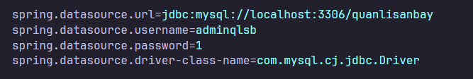
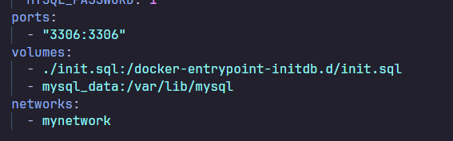

# Wings_Airport_OOPJava File Structure
```
Wings_Airport_OOPJava/
├── .idea/
│   ├── inspectionProfiles/
│   │   └── profiles_setting.xml
│   ├── misc.xml
│   ├── modules.xml  
│   ├── vcs.xml
│   └── Wings_Airport_OOPJava.iml
├── .mvn/  
│   └── wrapper/
│       └── maven-wrapper.properties
├── .vscode/   
│   └── settings.json
├── quanlisanbay/  
│   ├── docker-compose.yml
│   ├── Dockerfile
│   └── init.sql
├── Query MySQL/
│   ├── insertinto.sql
│   ├── QuanliSanBay.sql
│   └── TruyVannn.sql  
├── src/   
│   ├── main/
│   │   └── java/
│   │       ├── com/
│   │       │   └── example/
│   │       │       └── quanlisanbay/
│   │       │           ├── config/
│   │       │           │   ├── EmailService.java
│   │       │           │   ├── LoginRequired.java
│   │       │           │   ├── LoginRequiredInterceptor.java    
│   │       │           │   └── WebMvcConfig.java
│   │       │           ├── controllers/
│   │       │           │   ├── core/
│   │       │           │   │   ├── AdminController.java
│   │       │           │   │   └── SanBayController.java
│   │       │           │   ├── AsignmentController.java
│   │       │           │   ├── AuthController.java
│   │       │           │   ├── BookingController.java
│   │       │           │   ├── CustomerController.java
│   │       │           │   ├── DatabaseConnectionController.java
│   │       │           │   ├── EmailController.java
│   │       │           │   ├── EmployeeController.java
│   │       │           │   ├── FlightController.java
│   │       │           │   ├── FlightScheduleController.java
│   │       │           │   ├── LanguageController.java
│   │       │           │   ├── MainController.java
│   │       │           │   ├── PlaneController.java
│   │       │           │   └── PlaneTypeController.java
│   │       │           ├── model/
│   │       │           │   ├── ChuyenBay.java
│   │       │           │   ├── DatCho.java
│   │       │           │   ├── EmailRequest.java
│   │       │           │   ├── EmailResponse.java
│   │       │           │   ├── KhachHang.java
│   │       │           │   ├── LichBay.Java
│   │       │           │   ├── LoaiMayBay.java
│   │       │           │   ├── MayBay.java
│   │       │           │   ├── NhanVien.java
│   │       │           │   └── PhanCong.java
│   │       │           ├── repository/
│   │       │           │   ├── ChuyenBayRepository.java
│   │       │           │   ├── DatChoRepository.java
│   │       │           │   ├── KhackHangRepository.java
│   │       │           │   ├── LichBayRepository.java
│   │       │           │   ├── LoaiMayBayRepository.java
│   │       │           │   ├── MayBayRepository.java
│   │       │           │   ├── NhanVienRepository.java
│   │       │           │   └── PhanCongRepository.java
│   │       │           ├── repository/
│   │       │           │   ├── ChuyenBayService.java
│   │       │           │   ├── DatChoService.java
│   │       │           │   ├── KhackHangService.java
│   │       │           │   ├── LichBayService.java
│   │       │           │   ├── LoaiMayBayService.java
│   │       │           │   ├── MayBayService.java
│   │       │           │   ├── NhanVienService.java
│   │       │           │   └── PhanCongService.java
│   │       │           └── QuanlisanbayApplication.java
│   │       └── resources/
│   │           ├── static/
│   │           │   ├── css/
│   │           │   │   ├── styles_admin.css                
│   │           │   │   └── styles_sanbay.css
│   │           │   ├── images/
│   │           │   └── js/
│   │           │       └── sanbay/
│   │           │           ├── alert-noti.js
│   │           │           ├── an-khi-tat.js
│   │           │           ├── dom-preload.js
│   │           │           ├── dom-xoay.js
│   │           │           ├── fe-link-be.js
│   │           │           ├── language-switcher.js
│   │           │           ├── menu-helplink-languages.js
│   │           │           ├── send-mail.js
│   │           │           ├── slide-khampha.js   
│   │           │           ├── slide-anhto.js
│   │           │           ├── slide-khampha.js   
│   │           │           └── tin-tuc.js 
│   │           ├── lang/
│   │           │    ├── english.json
│   │           │    └── tieng-viet.json
│   │           ├── templates/
│   │           │    ├── admin.html
│   │           │    ├── login.html
│   │           │    ├── san_bay_en.html
│   │           │    └── san_bay.html
│   │           └── application.properties
│   └── test/
│       └── java/
│           └── com/
│               └── example/
│                   └── quanlisanbay/
│                       └── QuanlisanbayApplicationTests.java
├── api_collection.json
├── Filestructure.md
├── mvnw.cmd
├── pom.xml
├── readme-hdsd.md
└── README.md 
```

# Wings_Airport_OOPJava API Documentation

https://www.postman.com/descent-module-pilot-94690019/my-workspace/collection/38988190-965ce511-d183-4da0-8774-8a0cca93e420?action=share&creator=38988190

# 1.1. Tổng quan về sân bay Wings Airport

Sân bay quốc tế Wings Airport hướng đến là một sân bay thật sự trong hệ thống giao thông hàng không của Việt Nam. Với số lượng hành khách ngày càng tăng, và các chuyến bay [nội địa/quốc tế] được khai thác thường xuyên, Wings Airport của chúng em ra đời đang phải đối mặt với nhiều thách thức:

- **Đảm bảo an ninh, an toàn:** Hệ thống an ninh, an toàn phải được kiểm soát chặt chẽ và hiệu quả.
- **Nâng cao chất lượng dịch vụ:** Wings Airport phải không ngừng nâng cao chất lượng dịch vụ, mang đến sự hài lòng cho hành khách.
- **Tối ưu hóa hoạt động:** Quản lý hiệu quả nguồn lực, nhân sự và thông tin.

# 1.2. Lý do chọn đề tài

Việc lựa chọn đề tài "Xây dựng website quản lý sân bay Wings Airport" của chúng em được xem xét dựa trên những lý do sau:

- **Thứ nhất, nhu cầu thực tế**
- **Thứ hai, tính ứng dụng cao**
- **Thứ ba, phù hợp với năng lực**

# 1.3. Mục tiêu của dự án

Dự án "Xây dựng website quản lý sân bay Wings Airport" được thực hiện với mục tiêu: Xây dựng một hệ thống website cơ bản, hiệu quả, đáp ứng nhu cầu quản lý và vận hành cơ bản của sân bay mô phỏng Wings Airport.

Để đạt được mục tiêu tổng quát, dự án tập trung vào các mục tiêu cụ thể sau:

**Đối với chúng em:**

- Cung cấp hệ thống xử lý thông tin, hạn chế sai sót trong quá trình vận hành.
- Áp dụng kiến thức môn học và kỹ năng đã học vào thực tế.
- Là tiền đề cho các nghiên cứu, phát triển và ứng dụng công nghệ thông tin trong lĩnh vực quản lý sân bay trong tương lai.

**Đối với người sử dụng Wings Airport:**

- Cung cấp thông tin: Website cung cấp đầy đủ thông tin về chuyến bay, lịch bay,.. cho hành khách tra cứu một cách dễ dàng, thuận tiện.
- Nâng cao trải nghiệm của hành khách: Hỗ trợ hành khách thực hiện các thủ tục trực tuyến (đặt vé, check-in,...).

# 1.4. Phạm vi và giới hạn của dự án

## 1.4.1. Phạm vi

**Đối tượng phục vụ:** Website quản lý sân bay Wings Airport hướng đến phục vụ:

- **Quản trị viên:** Là những người có quyền hạn cao nhất, quản lý toàn bộ hệ thống và dữ liệu của website.
- **Hành khách:** Là những người sử dụng website để tra cứu thông tin, sử dụng các dịch vụ của sân bay, ví dụ: tra cứu chuyến bay, đặt vé máy bay,...

**Chức năng:** Website cung cấp các chức năng chính bao gồm:

- **Đối với quản trị viên:** Quản lý thông tin chuyến bay, quản lý nhân viên, quản lý tài khoản, thống kê báo cáo,...
- **Đối với hành khách:** Tra cứu thông tin chuyến bay, đặt vé máy bay, check-in online, sử dụng các dịch vụ, gửi phản hồi,...

## 1.4.2. Giới hạn

Do hạn chế về mặt thời gian, nguồn lực và kiến thức, dự của chúng em, bài tập lớn này có những giới hạn nhất định:

- Nhiều ràng buộc, trường hợp sử dụng dữ liệu chưa được xử lí hay lường đến.
- Dữ liệu được sử dụng trong quá trình xây dựng và demo hệ thống là dữ liệu mô phỏng.

Mặc dù còn nhiều hạn chế, nhưng chúng em đã cố gắng hết sức để hoàn thành tốt nhất các mục tiêu đề ra, đồng thời đảm bảo tính thực tiễn và khả năng ứng dụng của đề tài.


# 1.5. Hướng dẫn sử dụng

## Cho người dùng Visual Studio Code
## 1.5.1. Cài đặt Docker, Java, Maven, và các extension cần thiết
### Java:
- Truy cập vào trang chủ của Oracle và download phiên bản Oracle [Java 8](https://www.java.com/en/download/)
- Run file exe và đợi cho Java cài đặt
- Optional: kiểm tra phiên bản của Java trên máy bằng cách sử dụng Terminal/Powershell và chạy lệnh `Java --version`
### Docker:
- Truy cập vào trang web của Docker và download [Docker Desktop](https://www.docker.com/products/docker-desktop/)
- Chạy file exe và đợi cho Docker Desktop cài đặt
- Optional: kiểm tra phiên bản Docker bằng cách sử dụng Terminal/Powershell và chạy lệnh `docker --version`

### Extension:
- Visual studio code:
    - Truy cập vào phần extentsion của VSC
    - Tìm kiếm các extentsion của Spring Boot (Spring Intializr Java Support, Spring Boot Dashboard, Spring Boot Tools, etc...) của VMWare
### Maven:
- **Lưu ý**: máy cần có Java để chạy được Maven
- Tìm và truy cập trang download [Maven Apache](https://maven.apache.org/download.cgi)
- Ở phần Files tải về file "Binary zip archive"

- Thực hiện giải nén vào một folder riêng biệt
- Ấn nút Home và tìm "Edit the system enviroment variable"
- Trong cửa sổ System Properties chọn Enviroment Variables => Cửa sổ Enviroment Variables hiện lên
- Trong cửa sổ Enviroment Variables, dưới khu vực System Variable tìm hàng có tên "Path" => Ấn Edit => Cửa sổ Edit enviroment varible hiện lên

- Mở thư mục chứa Maven Apache và copy đường dẫn tới thư mục đó
- Quay lại cửa sổ Edit enviroment varible => Chọn New => Dán đường vẫn tới thư mục chứa Maven
- Mở thư mục chứa Maven Apache => Vào thư mục có tên "bin" và copy đường dẫn tới thư mục đó
- Tiếp tục quay lại cửa sổ Edit enviroment varible => Chọn New => Dán đường vẫn tới thư mục vừa copy
- Ấn ok ở tất cả các cửa sổ
- Optional: Restart máy
- Optional: kiểm tra phiên bản Maven bằng cách sử dụng Terminal/Powershell và chạy lệnh `mvn --version`

## 1.5.2 Chạy Project
### Bước 1: Khởi tạo Docker image và container:
- Mở Docker Desktop
- Mở Termial lên và chuyển hướng vào thư mục "quanlisanbay" `cd ./Wings_Airport_OOPJava/quanlisanbay`
- Chạy lệnh `docker-compose up -d`

**Lưu ý:** Nếu như xảy ra lỗi xung đột cổng 3306 thì cần đổi PORT ở các biến "spring.datasource.url" nằm trong file application.properties ở "Wings_Airport_OOPJava/src/main/resources/ và "target/classes"; ports ở docker-compose.yml trong "Wings_Airport_OOPJava/quanlisanbay" thành một cổng bất kỳ chưa được sử dụng


### Bước 2: Tải các dependencies cần thiết cho Spring Boot
- Mở Termial mới
- Chạy câu lệnh `mvn clean install` để tải lại các dependency cần thiết
- Chạy lệnh `mvn spring-boot:run -DskipTests` để chạy toàn bộ dự án

**Lưu ý:** 
- Website mặc định chạy ở http://localhost:8888 và PHP server chạy ở http://localhost:8080
- Tài khoản và mật khẩu của admin website là 1
- PHP server tài khoản: adminqlsb; mật khầu: 1

---


## Optional: Thêm dữ liệu vào PHP server
Có thể thêm các trường dữ liệu từ "Query MySQL/insertinto.sql" vào PHP server nhằm phục cho quá trình test project từ website
### Bước 1: Chạy docker-compose.yml
### Bước 2: Truy cập vào http://localhost:8080 và nhập tài khoản mật khẩu
### Bước 3: Chọn truy vấn SQL
### Bước 4: Chạy từng phần INSERT trong file insertinto.sql